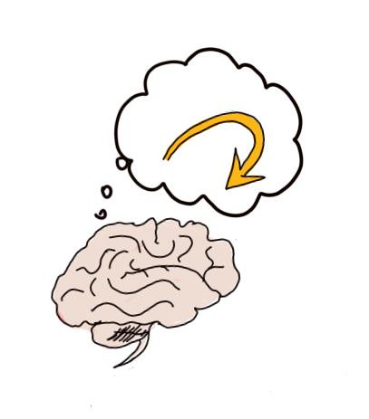

```{r setup, include=FALSE}
knitr::opts_chunk$set(echo = TRUE)
library(ggplot2)
library(GGally)
library(tidyverse)
library(stringr)
library(forecast)
library(pheatmap)
library(pracma)
library(data.table)
library(plyr)
library(psych)
library(mgcv)
library(knitr)
library(summarytools)
library(rccmisc)
library(TTR)
library(reshape2)
library(ggpubr)
## set global graphics options
theme_set(theme_bw())
## Load preprocessed data
datdir_sav <- "D:/data science/confidence/Confidence Database/"
df.time <- read.csv(paste(datdir_sav, "data_preproc_time"))
```


## What is metacognition?



## Comparing memory and perception studies
```{r Nsubj by Category, echo=FALSE, message=FALSE}
df.prune <- subset(df.time, Category %in% c("Memory", "Perception"))
df.prune <- droplevels(df.prune)
df.table <- table(df.prune$Category)/25
df.freq <- data.frame(df.table)
colnames(df.freq) <- c("Category", "Count")
ggplot(droplevels(df.freq), aes(x=Category, y=Count, na.rm = TRUE, color = Category, fill = Category)) +
  geom_bar(stat = "identity") + 
  ylab("Number of participants")
```


## Confidence 
```{r confidence, echo=FALSE, message=FALSE}
y <- "conf"   # confRT, conf
x <- "time"
# overall
g <- ggplot(subset(df.time, Category %in% c("Memory", "Perception")),
  aes_string(x=x, y=y, color="Category")) +
  geom_smooth(se = TRUE, level = 0.67) +
  ylab("Confidence (in SD)") +
  xlab("Time on task (in %)")
g
```


## Participants respond slightly faster than average when confident.  
```{r Confidence and response speed by Category, echo=FALSE, message=FALSE}
# overall
g.conf <- ggplot(subset(df.time, Category %in% c("Memory", "Perception")),
  aes_string(x=x, y="conf", color="Category")) +
  geom_smooth(se = TRUE, level = 0.67) +
  ylab("Confidence (in SD)") +
  xlab("Time on task (in %)") +
  ggtitle("Confidence")
g.confRT <- ggplot(subset(df.time, Category %in% c("Memory", "Perception")),
  aes_string(x=x, y="confRT", color="Category")) +
  geom_smooth(se = TRUE, level = 0.67) +
  ylab("Response speed (in SD)") +
  xlab("Time on task (in %)") +
  ggtitle("Response speed")
g.combi <- ggplot(subset(df.time, Category %in% c("Memory", "Perception")),
  aes_string(x="confRT", y="conf", color="Category")) +
  geom_smooth(se = TRUE, level = 0.67) +
  ylab("Confidence (in SD)") +
  xlab("Response speed (in SD)") +
  ggtitle("Correlation")
ggarrange(g.conf, g.confRT, g.combi,
          ncol = 2, nrow = 2, 
          common.legend = TRUE, legend="bottom")
```


## A correspondence between accuracy and confidence is present, but small. 
```{r Confidence and accuracy by Category, echo=FALSE, message=FALSE}
g.conf <- ggplot(subset(df.time, Category %in% c("Memory", "Perception")),
  aes_string(x=x, y="conf", color="Category")) +
  geom_smooth(se = TRUE, level = 0.67) +
  ylab("Confidence (in SD)") +
  xlab("Time on task (in %)") +
  ggtitle("Confidence")
g.acc <- ggplot(subset(df.time, Category %in% c("Memory", "Perception")),
  aes_string(x=x, y="acc", color="Category")) +
  geom_smooth(se = TRUE, level = 0.67) +
  ylab("Accuracy (in %)") +
  xlab("Time on task (in %)") +
  ggtitle("Accuracy")
g.combi <- ggplot(subset(df.time, Category %in% c("Memory", "Perception")),
  aes_string(x="acc", y="conf", color="Category")) +
  geom_smooth(se = TRUE, level = 0.67) +
  ylab("Confidence (in SD)") +
  xlab("Accuracy (in %)") +
  ggtitle("Correlation")
ggarrange(g.conf, g.acc, g.combi,
          ncol = 2, nrow = 2, 
          common.legend = TRUE, legend="bottom")
```


## Future work: Take into account response bias!


