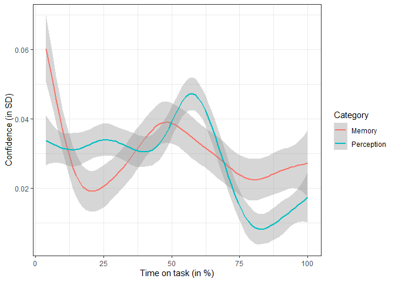

Is metacognition a general mechanism?
================

## What is metacognition?

## Comparing memory and perception studies

<!-- -->

## Confidence

<!-- -->

## Participants respond slightly faster than average when confident.

<!-- -->

## A correspondence between accuracy and confidence is present, but small.

<!-- -->

## Future work: Take into account response bias\!
